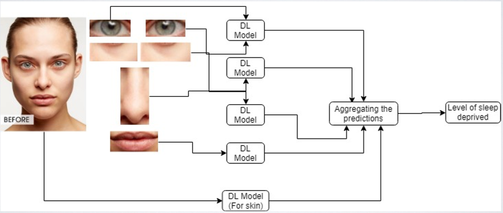

# Fatigue Detection using Deep Learning

This repository contains a project based on the research to detect fatigue levels of a person through a face picture. For this project the main facial cues used to detect fatigue levels are: Undereyes, Eyes, Mouth, Nose and Skin.

### Problem Statement
The complexities of fatigue have drawn much attention from researchers across various disciplines. Short-term fatigue may cause safety issue while driving; thus, dynamic systems were designed to track driver fatigue. Longterm fatigue could lead to chronic syndromes, and eventually affect individuals physical and psychological health. Traditional methodologies of evaluating fatigue not only require sophisticated equipment but also consume enormous time.

### Our Proposal
In this project, we attempt to develop a novel and efficient method to predict individual’s fatigue rate by scrutinising human facial cues. Our goal is to predict fatigue rate based on a single photo. Our work represents a promising way to assess sleep-deprived fatigue, and our project will provide a viable and efficient computational framework for user fatigue modelling in large-scale.

### Architecture
The architecture for this project is shown in the picture below. The image of a face is taken as input from which the facial landmarks are detected and cropped out. These cropped out facial landmarks such as eyes, undereyes, nose, mouth along with the entire face image for the skin is fed into individual models trained on these specific features. The individual models return a value which corresponds to the fatigue levels. These values are then taken as a weighted sum (where eyes and undereyes are given more weightage) which is used as the final value to determine the fatigue level of a person.

<p align="center">

</p>

### Setup Instructions
<ol>
<li>Clone the entire repository into your local machine.</li>
<li>Download contents of <a href="#">object_detection </a> folder from TO BE UPLOADED and place all the contents in the folder.</li>
<li>Download the <a href="#"> models </a> from TO BE UPLOADED and place all the contents in models/image_classification.</li>


  <p> Open Anaconda Command Prompt and Setup a new environment</p>
   
  ```
   C:\> conda create -n FatigueDetection pip python=3.6
  ```

  <p>Activate the environment and upgrade pip </p>
  
  ```
  C:\>conda activate FatigueDetection
  (FatigueDetection) C:\>python -m pip install --upgrade pip
  ```
  <p>All other requirements can be installed using requirements.txt</p>
  
  ```
   (FatigueDetection) C:\>pip install -r requirements.txt
  ```

<li> After all the package installations has been done navigate to the directory where the project has been downloaded and run "test.py":
  
  ```
  (FatigueDetection) C:\> python test.py
  ```
<p align="center"> After running the above command you should get a screen that looks like this.

### Note : The lower the score, the higher level of fatigue.

Current aggregation used for final score:
  ```
(((sum of left eye and right eye scores) / 2)*0.4) + (((sum of left under-eye and right under-eye scores)/2)*0.55) + (((sum of nose, face and mouth scores)/3)*0.05
  ```
This aggregation has been done through basic intuitive hypothesis. Please feel free to assign weights according your own hypothesis. For eg. - Linear Regression can be used to assign specific weights to each part of the face.


### Data:
<p> You can download the data used for the project from <a href="https://zenodo.org/api/files/fc89114d-f49d-42b1-a277-2a2b08bf4ea9/dataset.zip">here</a>. </p>
